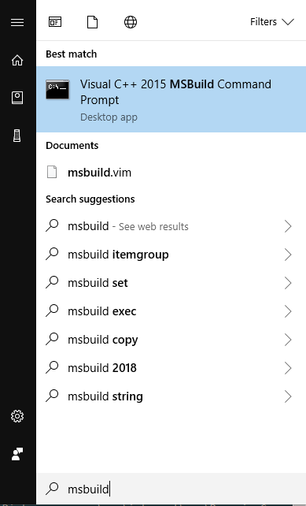

# Dev

## How do I build LabSound?

* clone [https://github.com/webmixedreality/exokit](https://github.com/webmixedreality/exokit)
  * `cd exokit && yarn && cd ..`
* clone [https://github.com/modulesio/LabSound](https://github.com/modulesio/LabSound)
* `cd LabSound/labsound`
* Run the os-specific build script
  * On Windows, this is `build-windows.cmd`
  * On Windows, use the Visual C++ 2015 MSBuild Command Prompt. \(This was installed along with [windows-build-tools](https://www.npmjs.com/package/windows-build-tools).\)

